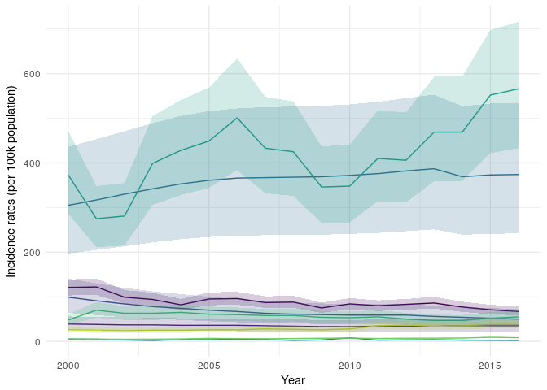
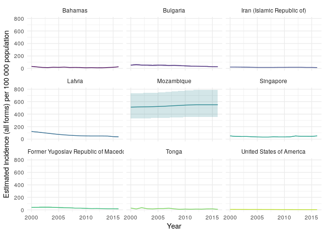
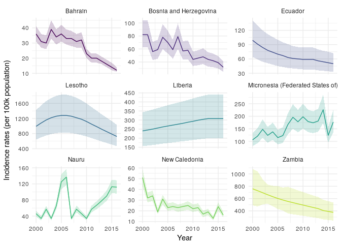
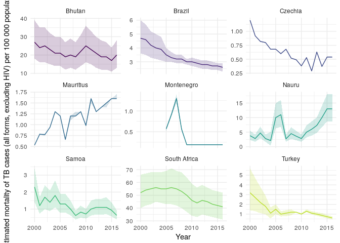
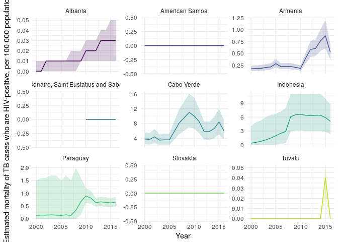

Get TB Data in R
================

[](https://cran.r-project.org/package=getTBinR) [](https://travis-ci.org/seabbs/getTBinR) [](https://codecov.io/github/seabbs/getTBinR?branch=master) [](https://ci.appveyor.com/project/seabbs/getTBinR)

Quickly and easily import analysis ready TB burden data, from the World Health Orgnaisation (WHO), into R. The aim of the package is to speed up access to high quality TB burden data, using a simple R interface. Commonly required, aggregated, datasets are provided so that more time can be spent conducting analysis. This package is inspired by a blog [post](https://incidental-ideas.org/2017/03/03/who-tuberculosis-data-ggplot2/), which looked at WHO TB incidence rates. See [here](http://www.who.int/about/copyright/en/) for the WHO data permissions.

Using the package
-----------------

First load the package. We also load several other packages to help quickly explore the data.

``` r
library(getTBinR)
library(ggplot2)
library(knitr)
library(magrittr)
library(dplyr)
```

### Getting TB burden data

Get TB burden data with a single function call. This will download the data if it has never been accessed and then save a local copy. If a local copy exists this will be loaded instead.

``` r
tb_burden <- get_tb_burden()

tb_burden
#> # A tibble: 3,651 x 71
#>        country  iso2  iso3 iso_numeric g_whoregion  year e_pop_num
#>          <chr> <chr> <chr>       <chr>       <chr> <int>     <int>
#>  1 Afghanistan    AF   AFG         004         EMR  2000  20093756
#>  2 Afghanistan    AF   AFG         004         EMR  2001  20966463
#>  3 Afghanistan    AF   AFG         004         EMR  2002  21979923
#>  4 Afghanistan    AF   AFG         004         EMR  2003  23064851
#>  5 Afghanistan    AF   AFG         004         EMR  2004  24118979
#>  6 Afghanistan    AF   AFG         004         EMR  2005  25070798
#>  7 Afghanistan    AF   AFG         004         EMR  2006  25893450
#>  8 Afghanistan    AF   AFG         004         EMR  2007  26616792
#>  9 Afghanistan    AF   AFG         004         EMR  2008  27294031
#> 10 Afghanistan    AF   AFG         004         EMR  2009  28004331
#> # ... with 3,641 more rows, and 64 more variables: e_inc_100k <dbl>,
#> #   e_inc_100k_lo <dbl>, e_inc_100k_hi <dbl>, e_inc_num <int>,
#> #   e_inc_num_lo <int>, e_inc_num_hi <int>, e_inc_num_f014 <int>,
#> #   e_inc_num_f014_lo <int>, e_inc_num_f014_hi <int>,
#> #   e_inc_num_f15plus <int>, e_inc_num_f15plus_lo <int>,
#> #   e_inc_num_f15plus_hi <int>, e_inc_num_f <int>, e_inc_num_f_lo <int>,
#> #   e_inc_num_f_hi <int>, e_inc_num_m014 <int>, e_inc_num_m014_lo <int>,
#> #   e_inc_num_m014_hi <int>, e_inc_num_m15plus <int>,
#> #   e_inc_num_m15plus_lo <int>, e_inc_num_m15plus_hi <int>,
#> #   e_inc_num_m <int>, e_inc_num_m_lo <int>, e_inc_num_m_hi <int>,
#> #   e_inc_num_014 <int>, e_inc_num_014_lo <int>, e_inc_num_014_hi <int>,
#> #   e_inc_num_15plus <int>, e_inc_num_15plus_lo <int>,
#> #   e_inc_num_15plus_hi <int>, e_tbhiv_prct <dbl>, e_tbhiv_prct_lo <dbl>,
#> #   e_tbhiv_prct_hi <dbl>, e_inc_tbhiv_100k <dbl>,
#> #   e_inc_tbhiv_100k_lo <dbl>, e_inc_tbhiv_100k_hi <dbl>,
#> #   e_inc_tbhiv_num <int>, e_inc_tbhiv_num_lo <int>,
#> #   e_inc_tbhiv_num_hi <int>, e_mort_exc_tbhiv_100k <dbl>,
#> #   e_mort_exc_tbhiv_100k_lo <dbl>, e_mort_exc_tbhiv_100k_hi <dbl>,
#> #   e_mort_exc_tbhiv_num <int>, e_mort_exc_tbhiv_num_lo <int>,
#> #   e_mort_exc_tbhiv_num_hi <int>, e_mort_tbhiv_100k <dbl>,
#> #   e_mort_tbhiv_100k_lo <dbl>, e_mort_tbhiv_100k_hi <dbl>,
#> #   e_mort_tbhiv_num <int>, e_mort_tbhiv_num_lo <int>,
#> #   e_mort_tbhiv_num_hi <int>, e_mort_100k <dbl>, e_mort_100k_lo <dbl>,
#> #   e_mort_100k_hi <dbl>, e_mort_num <int>, e_mort_num_lo <int>,
#> #   e_mort_num_hi <int>, cfr <dbl>, cfr_lo <dbl>, cfr_hi <dbl>,
#> #   c_newinc_100k <dbl>, c_cdr <dbl>, c_cdr_lo <dbl>, c_cdr_hi <dbl>
```

### Searching for variable definitions

The WHO provides a large, detailed, data dictionary for use with the TB burden data. However, searching through this dataset can be tedious. To streamline this process `getTBinR` provides a search function to find the definition of a single or multiple variables. Again if not previously used this function will download the data dictionary, but in subsequent uses will load a local copy.

``` r
vars_of_interest <- search_data_dict(var = c("country",
                                             "e_inc_100k",
                                             "e_inc_100k_lo",
                                             "e_inc_100k_hi"))
#> 4 results found for your variable search for country, e_inc_100k, e_inc_100k_lo, e_inc_100k_hi
#> 0 results found for your definition search for

knitr::kable(vars_of_interest)
```

| variable\_name   | dataset                | code\_list | definition                                                         |
|:-----------------|:-----------------------|:-----------|:-------------------------------------------------------------------|
| country          | Country identification |            | Country or territory name                                          |
| e\_inc\_100k     | Estimates              |            | Estimated incidence (all forms) per 100 000 population             |
| e\_inc\_100k\_hi | Estimates              |            | Estimated incidence (all forms) per 100 000 population, high bound |
| e\_inc\_100k\_lo | Estimates              |            | Estimated incidence (all forms) per 100 000 population, low bound  |

We might also want to search the variable definitions for key phrases, for example mortality.

``` r
defs_of_interest <- search_data_dict(def = c("mortality"))
#> 0 results found for your variable search for
#> 6 results found for your definition search for mortality

knitr::kable(defs_of_interest)
```

| variable\_name                | dataset   | code\_list | definition                                                                                     |
|:------------------------------|:----------|:-----------|:-----------------------------------------------------------------------------------------------|
| e\_mort\_exc\_tbhiv\_100k     | Estimates |            | Estimated mortality of TB cases (all forms, excluding HIV) per 100 000 population              |
| e\_mort\_exc\_tbhiv\_100k\_hi | Estimates |            | Estimated mortality of TB cases (all forms, excluding HIV), per 100 000 population, high bound |
| e\_mort\_exc\_tbhiv\_100k\_lo | Estimates |            | Estimated mortality of TB cases (all forms, excluding HIV), per 100 000 population, low bound  |
| e\_mort\_tbhiv\_100k          | Estimates |            | Estimated mortality of TB cases who are HIV-positive, per 100 000 population                   |
| e\_mort\_tbhiv\_100k\_hi      | Estimates |            | Estimated mortality of TB cases who are HIV-positive, per 100 000 population, high bound       |
| e\_mort\_tbhiv\_100k\_lo      | Estimates |            | Estimated mortality of TB cases who are HIV-positive, per 100 000 population, low bound        |

Finally we could both search for a known variable and for key phrases in variable definitions.

``` r
vars_defs_of_interest <- search_data_dict(var = c("country"),
                                     def = c("mortality"))
#> 1 results found for your variable search for country
#> 6 results found for your definition search for mortality

knitr::kable(vars_defs_of_interest)
```

| variable\_name                | dataset                | code\_list | definition                                                                                     |
|:------------------------------|:-----------------------|:-----------|:-----------------------------------------------------------------------------------------------|
| country                       | Country identification |            | Country or territory name                                                                      |
| e\_mort\_exc\_tbhiv\_100k     | Estimates              |            | Estimated mortality of TB cases (all forms, excluding HIV) per 100 000 population              |
| e\_mort\_exc\_tbhiv\_100k\_hi | Estimates              |            | Estimated mortality of TB cases (all forms, excluding HIV), per 100 000 population, high bound |
| e\_mort\_exc\_tbhiv\_100k\_lo | Estimates              |            | Estimated mortality of TB cases (all forms, excluding HIV), per 100 000 population, low bound  |
| e\_mort\_tbhiv\_100k          | Estimates              |            | Estimated mortality of TB cases who are HIV-positive, per 100 000 population                   |
| e\_mort\_tbhiv\_100k\_hi      | Estimates              |            | Estimated mortality of TB cases who are HIV-positive, per 100 000 population, high bound       |
| e\_mort\_tbhiv\_100k\_lo      | Estimates              |            | Estimated mortality of TB cases who are HIV-positive, per 100 000 population, low bound        |

### Plotting Incidence Rates over Time in 9 Randomly Sampled Countries

To showcase how quickly we can go from no data to plotting informative graphs we quickly explore incidence rates in a sample of 9 countries using the inbuilt `plot_tb_burden` function. We first plot incidence rates, with 95% confidence intervals, in the 9 randomly sampled countries. As you can see this isnt a hugely informative graph. Lets improve it!

``` r
## Take a random sample of countries
sample_countries <- sample(unique(tb_burden$country), 9)
plot_tb_burden(tb_burden, metric = "e_inc_100k",
               countries = sample_countries)
```



We have faceted by country so that we can more easily see what is going on. This allows us to easily explore between country variation - depending on the sample there is likely to be alot of this.

``` r
plot_tb_burden(tb_burden, metric = "e_inc_100k",
               countries = sample_countries,
               facet = "country")
```



To explore within country variation we need to change the scale of the y axis.

``` r
plot_tb_burden(tb_burden, metric = "e_inc_100k",
               countries = sample_countries,
               facet = "country",
               scales = "free_y")
```



We might also be interested in mortality in both HIV negative and HIV positive cases in our sample countries. We can also look at this using `plot_tb_burden` as follows.

``` r
plot_tb_burden(tb_burden, metric = "e_mort_exc_tbhiv_100k",
               countries = sample_countries,
               facet = "country",
               scales = "free_y")
```



``` r
plot_tb_burden(tb_burden, metric = "e_mort_tbhiv_100k",
               countries = sample_countries,
               facet = "country",
               scales = "free_y")
```



### Planned Functionality

In future releases I plan to add addiitonal functionality that will import more data and aggregate existing datasets so that they are readily usable for analysis.

Installation
------------

You can install getTBinR from github with:

``` r
# install.packages("devtools")
devtools::install_github("seabbs/getTBinR")
```

### Docker

This package has been developed in docker based on the `rocker/tidyverse` image, to access the development environment enter the following at the command line (with an active docker daemon running),

``` bash
docker pull seabbs/gettbinr
docker run -d -p 8787:8787 -e USER=getTBinR -e PASSWORD=getTBinR --name getTBinR seabbs/gettbinr
```

The rstudio client can be accessed on port `8787` at `localhost` (or your machines ip). The default username is getTBinR and the default password is getTBinR.
